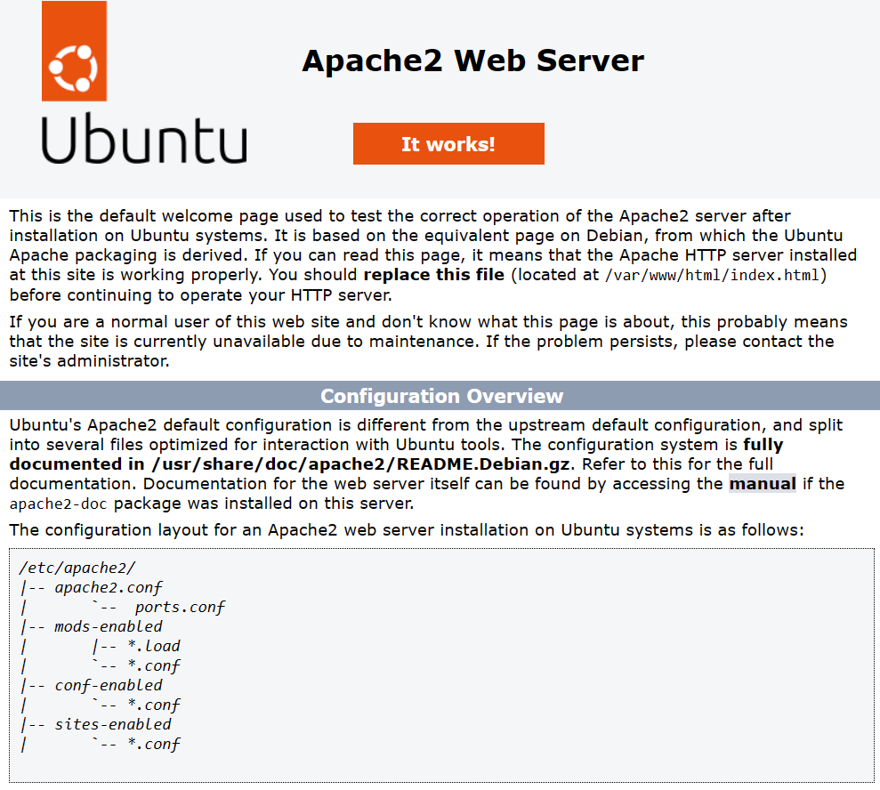

# Setup: Server

!!! note
    All this has been done on the current CADS server running on `http://cads.iiitb.ac.in`. If there appears to be an issue, or you have started a new server to run and test the utilities and the Druid cluster follow along.

## SSH into Server

After securing the credentials, simply open up a Powershell window and SSH into the server through the command: 

```> ssh -p <PORT_NUMBER> hostname@ip ```

You'll be prompted to enter the password. Enter in and you'll be logged into the server with a prompt like: `iiitb@iiitb-vm $`. 

Both the hostname and the IP should be provided, along with the password and port number. Contact IT, if not.

## Setup Website
As of the writing of this document, the server used by IIITB is Apache2. So, when you get the server credentials, confirm by visiting the IP address that you are getting an output similar to this:

{ align=center style="height:256px;width:256px"}

Okay, so if you have that, it means the Apache2 Server is set up and ready to deploy the utilities.

The default directory that Apache2 looks for webpages is the `/var/www/html/` directory, for our purposes we created the directory `/var/www/html/upload`. Simply place all the contents of the `data-ingestion/*` directory here.

!!! warning
    Please ensure that the `datasets/` directory and the `metadata.json` is backed up if you are planning to delete or replace the `/var/www/html/uploads/` directory.

!!! warning
    Please also ensure that read & write access is enabled on the `upload/` directory as without it, our PHP scripts will not be able to read or write to the datasets directory or the metadata and log files.

The following script backs up the `datasets/*` directory, the `metadata.json` file, and then clones the repository from GitHub and updates the `var/www/html/upload/` directory. 

```bash
rm -rf ./KDL_SRIP23
# Place your own repo here
git clone https://github.com/RelativisticMechanic/KDL_SRIP23
# Save the datasets directory
sudo cp -R /var/www/html/upload/datasets/* ~/datasets/
# Save the metadata json
sudo cp -R /var/www/html/upload/metadata.json ./metadata.json
sudo cp -R /var/www/html/upload/log.txt ./log.txt
sudo rm -rf /var/www/html/upload
sudo mkdir /var/www/html/upload
sudo cp -r ./KDL_SRIP23/data_ingestion/* /var/www/html/upload/
sudo cp -R ./datasets/* /var/www/html/upload/datasets/
sudo cp ./metadata.json /var/www/html/upload
sudo cp ./log.txt /var/www/html/upload/
sudo chmod -R 777 /var/www/html/upload/
```

Save it as something like `update_website.sh` in the user home directory (usually `/home/iiitb/`) and remember to `chmod +x ./update_website.sh`.

## Enabling PHP Limits

By default Apache2 is configured to only around a POST data of 8 MB and file data of 2 MB. This is obviously not ideal for us as some of the CSV files can be as large as 70-80 MB. So we'll have to change this.

Open up the php.ini for Apache2 in the editor of your choice,

```sh
sudo vim /etc/php/8.1/apache2/php.ini
```

Now find and set the following variables.

```ini
post_max_size=128M
upload_max_filesize=100M
```

Now, restart Apache.

```
sudo service apache2 restart
```

## Setting up Python on the Server

This bothered me a lot as it seems that pip does not install packages system wide. So even if pandas was installed for the user `iiitb`, the Python scripts being executed by the PHP script called by Apache2 were not able find pandas. 

The workaround was to simply install pip packages with root (`sudo pip install ...`) but that is a very hacky solution and I haven't yet figured out how to set up a Python virtual environment for Apache2.

## Setting up Druid as Service

Unlike in a development environment when you'll have Druid running in one of your terminals, this is not possible on a server environment where Druid needs to be running in the background as a service. So we'll need to set Druid up as a service.

Once you've downloaded and extracted Druid to the directory `/home/iiitb/Druid/`, open the file `/etc/systemd/system/druid.service` in your text editor and place the following configuration:

```s
[Unit]
Description=Apache Druid Daemon
Documentation=http://druid.io
Requires=network.target
After=network.target

[Service]
Type=simple
WorkingDirectory=/home/iiitb/Druid/apache-druid-26.0.0
User=iiitb
Group=iiitb
ExecStart=/home/iiitb/Druid/apache-druid-26.0.0/bin/start-druid

[Install]
WantedBy=default.target
```

This sets up Druid as a service. Now, we need to update systemd of our changes. Simply run:

```sudo systemctl daemon-reload```

No errors should be reported. Now, start Druid by:

```sudo systemctl start druid```

Congratulations, you have set up the server environment.